# limit-order-book

## Mental Model
- a limit book is just two sorted collections
- one high-to-low (bids)
- one low-to-high (asks)
- imagine (low <- high (buyers)) | matching point | ((sellers) low -> high)
- at same prive level, match in FIFO
- unmatched orders stays in the book until it is cancelled/expires/filled

## Lifecycle Of An Order

## Learning Resources
# Before Writing Code
[KHEX Trading Mechanism](https://www.hkex.com.hk/Services/Trading/Securities/Overview/Trading-Mechanism?sc_lang=en) How an exchange describes price-time priority
[Building a Market Data Feed with Liquibook](https://objectcomputing.com/resources/publications/sett/august-2013-building-a-market-data-feed-with-liquibook) How the book connects to the wider exchange system, order gateway, market data feed etc

# After Creating Basic Order Book
[Liquibook C++ matching Engine](https://github.com/enewhuis/liquibook) Study after completing your own version
[How To Build a Fast Limit Order book](https://web.archive.org/web/20110205154238/http://howtohft.blogspot.com/2011/02/how-to-build-fast-limit-order-book.html)
[CME Group MDP3.0 Spec](https://cmegroupclientsite.atlassian.net/wiki/spaces/EPICSANDBOX/pages/457219613/CME+MDP+3.0+Market+Data) How real market data feeds work

# C++ Skills Reference
[C++ Ref](https://en.cppreference.com/)

## Data Structure Decision 

